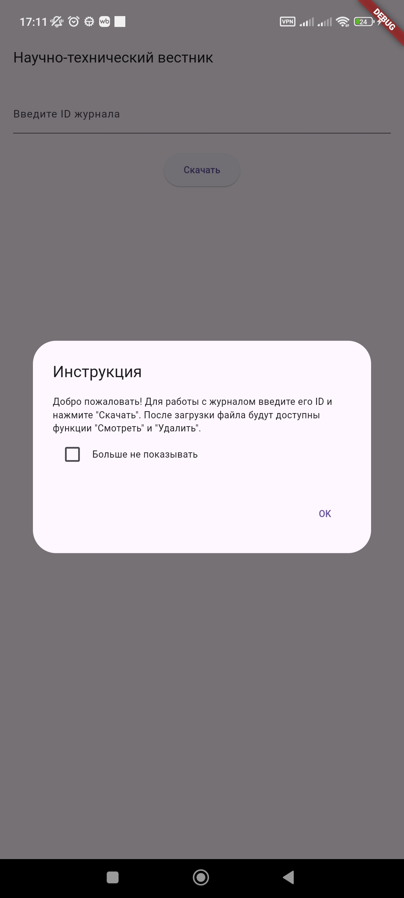
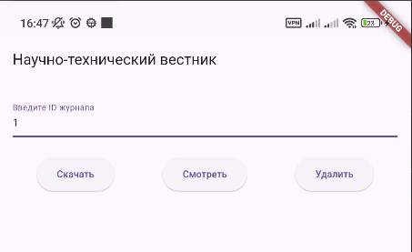

# Лабораторная работа №5. Хранение данных. Настройки и внешние файлы.

Цель работы: Изучить инструменты хранения данных, а также работу с внешними файлами.

*Выполнила*: Иволгина Елизавета  
*Язык*: Dart

## Описание
Приложение "Научно-технический вестник" разработано на языке Dart. Оно предназначено для загрузки, просмотра и удаления PDF-файлов научных журналов по их ID.

При первом запуске пользователь видит всплывающее окно с инструкцией по использованию. Окно содержит чекбокс "Больше не показывать", который позволяет отключить показ инструкции в будущем.
<center></center>

### Основное рабочее пространство состоит из:
* Поля для ввода ID журнала с подсказкой "Введите ID журнала".
* Трёх кнопок:
    * "Скачать" – активна всегда, используется для загрузки файла.
    * "Смотреть" – появляется после успешной загрузки, позволяет открыть PDF-файл.
    * "Удалить" – также доступна после загрузки, удаляет загруженный файл.
<center></center>

<center></center>

## Как работает?

### Всплывающее окно с инструкцией
При первом запуске отображается окно с информацией о работе приложения и чекбокс "Больше не показывать".
```SharedPreferences``` проверяет, показывалось ли окно раньше. Если нет, отображается окно с инструкцией.
Пользовательская настройка сохраняется через ```setBool```.

```
showDialog(
  context: context,
  builder: (context) {
    return AlertDialog(
      title: Text('Инструкция'),
      content: Text('Для работы введите ID журнала и нажмите "Скачать".'),
    );
  },
);

```

 ### Скачивание файла
 Функция ```downloadJournal``` отправляет HTTP-запрос для загрузки файла, проверяет тип содержимого ответа, а затем сохраняет файл, если это PDF.
В случае ошибки приложение показывает уведомление через ```SnackBar```.
```
final response = await http.get(Uri.parse(url));
if (response.statusCode == 200 && response.headers['content-type'] == 'application/pdf') {
  final directoryPath = await getAppDirectory();
  final filePath = '$directoryPath/$id.pdf';
  await File(filePath).writeAsBytes(response.bodyBytes); // Сохранение файла
} else {
  ScaffoldMessenger.of(context).showSnackBar(
    SnackBar(content: Text('Файл не найден или не является PDF')),
  );
}
```
<center></center>

### Просмотр файла
Кнопка "Смотреть" вызывает функцию ```openPdf```, которая открывает скачанный файл через приложение для работы с PDF. Если файл не открылся, показывается уведомление.
```
final result = await OpenFile.open(filePath);
if (result.type != ResultType.done) {
  ScaffoldMessenger.of(context).showSnackBar(
    SnackBar(content: Text('Не удалось открыть файл. Установите приложение для просмотра PDF.')),
  );
}
```

### Удаление файла
Кнопка "Удалить" вызывает метод ```deleteFile```, который удаляет файл из локального хранилища, если он существует.
```
if (await file.exists()) {
  await file.delete(); // Удаление файла
  ScaffoldMessenger.of(context).showSnackBar(
    SnackBar(content: Text('Файл удалён')),
  );
}
```  
****  
  
### Как собрать
* Установите Flutter SDK.
* Настройте Android studio: Установите плагины Flutter и Dart.
1. Загрузите репозиторий
2. Запустите Android Studio
3. Нажмите на "Open" и выберите папку с проектом
4. Выберите эмулятор(или подключите реальное устройство)
5. Нажмите "Run"